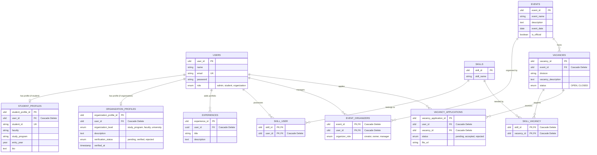

# Product Requirements Document (PRD) - CommitIn Platform

CommitIn is a collaborative event volunteer and committee recruitment platform designed specifically for academic environments. It connects **Students** looking for campus experiences with **Organizations** (clubs, student bodies, faculties) seeking to staff their events and project divisions.

---

## 1. System Architecture & Entity Relationships

Below is the visual map of CommitIn's database schema showing how users, profiles, events, vacancies, skills, and applications interact.

---

## 2. Deduced Business Rules & Constraints

Based on the schema definitions, the system must enforce the following business rules:

### A. Role-Based Account Segmentation
- A user must have exactly one role: `student`, `organization`, or `admin`.
- **Students** must possess a [student_profile](file:///home/orizyn/web_ii_project/commitin/database/migrations/2026_06_16_165730_create_student_profile_table.php) with a unique `student_id` (representing matriculation or registration numbers).
- **Organizations** must possess an [organization_profile](file:///home/orizyn/web_ii_project/commitin/database/migrations/2026_06_16_165744_create_organization_profile_table.php) defining their scope (`study_program`, `faculty`, or `university` level).
- **Organization Trust Lifecycle**: New organizations start with `verification_status = 'pending'`. They must be manually vetted by an `admin`. Once approved, the status is updated to `verified` and `verified_at` is stamped.

### B. Event Ownership & Collaboration
- Events are not owned by a single user. Instead, the `event_organizers` pivot table manages ownership. 
- Multiple users can collaborate on the same event with different roles:
  - `creator`: The initial event instantiator.
  - `owner`: Highest administrative permissions over the event.
  - `manager`: Operational permissions (can view applicants, manage vacancies, but perhaps cannot delete the event).
- **Event Officialdom**: Events have an `is_official` boolean. This distinguishes student-run/informal projects from university-sanctioned events.

### C. Event-Bound Vacancies & Division-Based Staffing
- A `vacancy` cannot exist independently; it must belong to an `event`. This indicates that CommitIn is designed for **event committee and volunteer staffing**, rather than long-term corporate jobs.
- Vacancies are created for specific divisions (e.g., "Logistic", "Design", "Sponsorship").
- Each vacancy can define zero or more required/preferred skills using the `skill_vacancy` pivot.

### D. Application Submissions
- A student can apply for an `OPEN` vacancy.
- The application requires a file upload (a resume or proof of skill) stored as a URL up to 2083 characters (`file_url`).
- Applications start as `pending`. Event organizers can move them to `accepted` or `rejected`.

---

## 3. User Capabilities Matrix

| Capability | Admin | Student | Organization (Verified) | Organization (Unverified) |
| :--- | :---: | :---: | :---: | :---: |
| **Manage Profile & Skills** | Yes | Yes | Yes | Yes |
| **Verify Organizations** | Yes | No | No | No |
| **Manage Skills Directory** | Yes | No | No | No |
| **Create Events** | Yes | No | Yes | No |
| **Add Event Organizers & Assign Roles** | Yes | No | Yes (Only for own events) | Yes (Only for own events) |
| **Post Vacancies** | Yes | No | Yes (Only for own events) | No |
| **Apply for Vacancies** | No | Yes | No | No |
| **Accept/Reject Applications** | Yes | No | Yes (Only for own vacancies) | Yes (Only for own vacancies) |
| **Manage Personal Experiences** | No | Yes | No | No |

---

## 4. Concrete & Prioritized Feature Roadmap

### Phase 1: Core User Identity & Authentication (P0)
*Foundation features required before any event management or recruitment can occur.*

- **User Registration & Role Selection**: Sign up flow with role validation (`student`, `organization`).
- **Student Profile Management**:
  - CRUD for student-specific info: Faculty, Study Program, Entry Year, Bio.
  - CRUD for User Skills (connecting to `skill_user` pivot).
  - CRUD for Experiences (adding past titles and descriptions).
- **Organization Profile Management**:
  - Profile setup detailing the organization level (`study_program`, `faculty`, `university`).
  - Request verification state.
- **Admin Verification Dashboard**:
  - Admin view listing all pending organizations.
  - Actions to Approve (changes status to `verified`, stamps `verified_at`) or Reject.

---

### Phase 2: Event & Vacancy Publishing (P1)
*Enables organizations to establish events and specify what help they need.*

- **Event Lifecycle Management**:
  - Creators can create, update, and close events.
  - Event Detail page featuring date, description, and list of open divisions.
- **Collaborative Organizing (Event Team)**:
  - Add/Remove other users to the event organizing team.
  - Transfer ownership or update roles (`creator`, `owner`, `manager`).
- **Vacancy Publishing**:
  - Add vacancies for specific event divisions (e.g. division name, role description).
  - Select required skills from the master skill list to attach to the vacancy.
  - Toggle vacancy status (`OPEN` / `CLOSED`).

---

### Phase 3: Application & Recruitment Workflow (P1)
*Allows students to apply and enables organizations to select their teams.*

- **Vacancy Discovery (Student Job Board)**:
  - Filter vacancies by event date, division, and matching skills.
  - Search engine for events.
- **Application Submission**:
  - Submit application for an open vacancy.
  - File upload client (e.g. PDF resume/portfolio upload to S3/Cloudinary) and saving the `file_url`.
  - Prevent duplicate applications to the same vacancy.
- **Recruitment Desk (Organizer View)**:
  - Dashboard for event organizers listing incoming applications.
  - Access to applicant profile, matching skills, experiences, and uploaded document (`file_url`).
  - Action buttons: "Accept" / "Reject" (updating status in `vacancy_applications`).

---

### Phase 4: Matching, Analytics & Polish (P2)
*Optimization and quality-of-life features to drive engagement.*

- **Smart Skill Matching**:
  - Highlight vacancies where the student has all or most required skills.
  - "Quick Apply" recommendations based on profile skills.
- **Organization Dashboard & Analytics**:
  - Metrics on applicant count, accept rates, and division supply/demand.
- **Master Skill Management (Admin)**:
  - Admin dashboard to manage the global list of `skills` (to prevent duplicates and messy entries).

---

## 5. Current Implementation Status & Codebase Mapping

Based on the actual codebase files, here is the current state of implementation:

### A. Completed Foundations
- **Global Role Protection Middleware**: 
  - Implemented in [CheckRole.php](file:///home/orizyn/web_ii_project/commitin/app/Http/Middleware/CheckRole.php).
  - Registered as `role` in the global middleware configuration within [app.php](file:///home/orizyn/web_ii_project/commitin/bootstrap/app.php#L15).
- **Core Models with Custom ULID Primary Keys**:
  - [User.php](file:///home/orizyn/web_ii_project/commitin/app/Models/User.php)
  - [StudentProfile.php](file:///home/orizyn/web_ii_project/commitin/app/Models/StudentProfile.php)
  - [OrganizationProfile.php](file:///home/orizyn/web_ii_project/commitin/app/Models/OrganizationProfile.php)
  - [Experience.php](file:///home/orizyn/web_ii_project/commitin/app/Models/Experience.php)
  - [Skill.php](file:///home/orizyn/web_ii_project/commitin/app/Models/Skill.php)
  - [Event.php](file:///home/orizyn/web_ii_project/commitin/app/Models/Event.php)
  - [EventOrganizer.php](file:///home/orizyn/web_ii_project/commitin/app/Models/EventOrganizer.php) (extends Eloquent `Pivot`)
  - [Vacancy.php](file:///home/orizyn/web_ii_project/commitin/app/Models/Vacancy.php)
  - [VacancyApplication.php](file:///home/orizyn/web_ii_project/commitin/app/Models/VacancyApplication.php)
- **Model Relationships (Fully Defined)**:
  - [User.php](file:///home/orizyn/web_ii_project/commitin/app/Models/User.php) links to `studentProfile()` (HasOne), `organizationProfile()` (HasOne), `experiences()` (HasMany), `skills()` (BelongsToMany), `applications()` (HasMany), and `events()` (BelongsToMany).
  - [Event.php](file:///home/orizyn/web_ii_project/commitin/app/Models/Event.php) links to `organizers()` (BelongsToMany) and `vacancies()` (HasMany).
  - [Vacancy.php](file:///home/orizyn/web_ii_project/commitin/app/Models/Vacancy.php) links to `event()` (BelongsTo), `skills()` (BelongsToMany), and `applications()` (HasMany).
  - [VacancyApplication.php](file:///home/orizyn/web_ii_project/commitin/app/Models/VacancyApplication.php) links to `user()` (BelongsTo) and `vacancy()` (BelongsTo).
  - [Skill.php](file:///home/orizyn/web_ii_project/commitin/app/Models/Skill.php) links to `users()` (BelongsToMany) and `vacancies()` (BelongsToMany).
  - [Experience.php](file:///home/orizyn/web_ii_project/commitin/app/Models/Experience.php) links to `user()` (BelongsTo).
  - [StudentProfile.php](file:///home/orizyn/web_ii_project/commitin/app/Models/StudentProfile.php) and [OrganizationProfile.php](file:///home/orizyn/web_ii_project/commitin/app/Models/OrganizationProfile.php) both define a `user()` (BelongsTo) back-relation.
- **Authentication & Registration Subsystem**:
  - Livewire Volt components exist for student registration ([⚡register.blade.php](file:///home/orizyn/web_ii_project/commitin/resources/views/pages/auth/⚡register.blade.php)) and organization registration ([⚡register-organization.blade.php](file:///home/orizyn/web_ii_project/commitin/resources/views/pages/auth/⚡register-organization.blade.php)).
  - Routes in `routes/auth.php` mapped to Livewire guest pages: `register`, `register.organization`, `login`, `password.request`, `password.reset`.
  - Landing page redirects directly to `/dashboard`, with authentication active (email verification requirement removed from the core route group).

### B. In-Progress or Stubbed Code
- **Mock Vacancies Endpoint**:
  - [VacancyController.php](file:///home/orizyn/web_ii_project/commitin/app/Http/Controllers/VacancyController.php) serves hardcoded mock JSON results for `index()`.
- **Skeleton Admin Routes**:
  - Outlined and currently commented out in [web.php](file:///home/orizyn/web_ii_project/commitin/routes/web.php#L15-L37), pointing to Livewire Page classes under `\App\Livewire\Pages\Admin\...` which have not yet been generated in the workspace.
